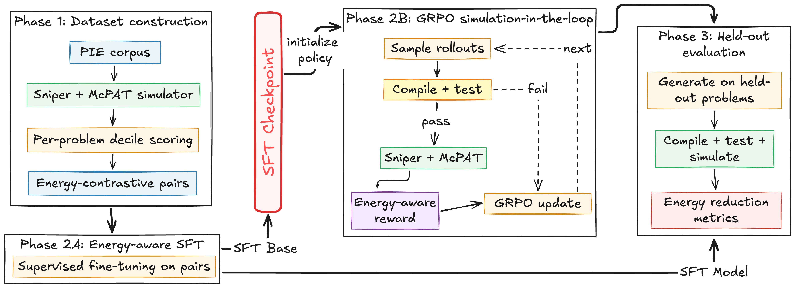

# Green Tea: Energy-Aware Code Generation via Simulation-Guided Reinforcement Learning

Replication package for the paper **"Beyond the Need for Speed: Energy-Aware Code Generation via Simulation-Guided Reinforcement Learning"** (Saurabhsingh Rajput and Tushar Sharma).



## Abstract

Code models strictly prioritize functional correctness, leaving software energy efficiency as an unoptimized byproduct. Training models to generate energy-efficient code requires reproducible feedback at scale, which physical hardware measurement cannot reliably provide due to variance.

In this paper, we replace hardware profiling with a deterministic architectural simulation harness to build **Green Tea**, a corpus of 3.5 million evaluations across 1,474 C++ problems. We train an energy-aware code model via supervised fine-tuning on energy-contrastive pairs, followed by closed-loop reinforcement learning (GRPO) using simulation-in-the-loop feedback. To rigorously evaluate deployment readiness, we introduce the **Correctness-Adjusted Reduction in Energy Total** (CARET), a metric that explicitly penalizes code that sacrifices functionality for efficiency.

On 143 held-out problems, our simulation-in-the-loop pipeline achieves 12.63% CARET, nearly tripling the gain of fine-tuning alone, and beats the energy efficiency of human-expert references on 58.4% of its valid outputs. Our analysis also exposes the *IPC trap*: standard throughput proxies like Instructions-Per-Cycle (IPC) actively misrank true energy efficiency on 67.8% of problems, demonstrating the necessity of direct energy simulation. By releasing our dataset and infrastructure, we bypass the 263,000 CPU-hours required for reproduction, empowering the community to train energy-efficient code generation models.

## Overview

We train code models to optimize a program's energy directly, using deterministic architectural simulation (Sniper/McPAT) as a scalable, reproducible energy signal, in two stages: energy-contrastive supervised fine-tuning (Energy-SFT) followed by a simulation-in-the-loop reinforcement-learning stage (GRPO). This repository contains the training and evaluation code, the analysis scripts that regenerate every table and figure, the pre-computed simulation results needed for that analysis, and the held-out benchmark.

## Artifact locations

| Artifact | Location |
|---|---|
| Code, analysis scripts, pre-computed sim results, 143-problem benchmark | This repository |
| Green Tea dataset (raw: 3,507,435 simulations, execution master, training pairs) | Zenodo: [10.5281/zenodo.21210100](https://doi.org/10.5281/zenodo.21210100) |
| Trained model checkpoints (Energy-SFT, GRPO, cross-family) | Hugging Face: `<HF_URL>` |

The raw dataset and model weights are hosted externally because of their size; everything required to reproduce the paper's numbers and figures is included here.

## Repository layout

```
green-tea/
├── config.env                     # set PROJECT_ROOT, then `source config.env`
├── requirements.txt               # Python dependencies
├── energy_data_collection/        # Sniper/McPAT energy-simulation harness
├── finetuning/                    # Energy-SFT + GRPO training and evaluation
│   ├── sft_train_trl.py           #   supervised fine-tuning
│   ├── grpo_trainer_vllm.py       #   simulation-in-the-loop GRPO
│   ├── evaluation.py              #   generation + Sniper evaluation
│   └── data/                      #   pre-computed sim_results (see "Data")
├── analysis/                      # scripts that regenerate all tables/figures
│   ├── rq1/  rq2/  rq3/  rq4/      #   one directory per research question
│   └── *.py                       #   dataset, RAPL, correlation analyses
├── evaluation/                    # benchmark comparison utilities
├── validation/                    # McPAT-vs-RAPL calibration and validation
└── sniper/                        # Sniper simulator (git submodule)
```

## Setup

1. Clone with the Sniper submodule:
   ```bash
   git clone --recurse-submodules git@github.com:SMART-Dal/green-tea.git
   cd green-tea
   ```
2. Install Python dependencies (Python 3.10):
   ```bash
   pip install -r requirements.txt
   ```
3. Configure paths:
   ```bash
   # edit PROJECT_ROOT in config.env to your clone location, then:
   source config.env
   ```
4. The analysis scripts run directly against the pre-computed data in this repository and do **not** require Sniper. Sniper/McPAT is only needed to regenerate energy simulations from scratch (see `energy_data_collection/README.md`).

## Reproducing the results

All analysis scripts resolve paths relative to the repository root and read the pre-computed simulation results included here.

```bash
python3 analysis/rq2/rq2.py          # main results and cross-family table; energy distribution and decomposition figures
python3 analysis/rq3/rq3.py          # initialization-by-reward ablation, pass@k, robustness, optimization-level sweep
python3 analysis/rq4/rq4.py          # transformation taxonomy, Stuart-Maxwell shift, per-category compiler analysis
python3 analysis/rq1/rq1.py          # within-problem energy landscape and IPC-trap analysis
python3 analysis/training_plots.py   # training-dynamics and hero-progression figures
```

`analysis/rq2/rq2.py` reads the cross-family simulation results from `data/cross_family_sim_results/` (override with the `GREEN_TEA_DATA` environment variable). The RQ1 landscape and dataset-statistics scripts additionally require the full execution corpus from Zenodo (`completed_samples.jsonl`, `PIE_Dataset/`).

## Data included in this repository

- `finetuning/data/*_sim_results/` and `finetuning/data/new_models/*/sim_results/`: per-model Sniper evaluation results used to compute the reported energy-reduction rates.
- `data/cross_family_sim_results/`: cross-family evaluation results (seven models).
- `finetuning/data/sft_energy_r32/`, `sft_energy_r128/`: LoRA-rank robustness results.
- `finetuning/data/{sft,grpo}_pass_at_k/`: pass@k results.
- `finetuning/data/sft_pairs_test.jsonl`: the 143-problem held-out benchmark.
- `analysis/*.jsonl`: aggregated training histories, per-solution metrics, and RAPL validation records.

## Data on Zenodo (not in git)

- `PIE_Dataset/` with `execution_master.jsonl` and per-problem batches: the raw energy-simulation corpus.
- `completed_samples.jsonl`: all 3,507,435 per-execution energy measurements.
- `finetuning/data/grpo_train.jsonl`, `sft_pairs_train.jsonl`: the energy-contrastive training pairs.

## Cluster scripts

Scripts under `finetuning/slurm/`, `energy_data_collection/slurm_execution_master.sh`, and similar `.sh` files are SLURM job templates. Adapt the `--account`, `--mail-user`, `module load` lines, and any cluster paths to your environment before use.

## Citation

```bibtex
@article{rajput2026greentea,
  title   = {Beyond the Need for Speed: Energy-Aware Code Generation via Simulation-Guided Reinforcement Learning},
  author  = {Rajput, Saurabhsingh and Sharma, Tushar},
  journal = {ACM Transactions on Software Engineering and Methodology},
  year    = {2026}
}
```

## License

Released under the MIT License (see `LICENSE`). The Sniper submodule and the PIE/CodeNet-derived data retain their original licenses.
